### This project converts the amazon sales report data from csv file into neo4j graph database.

### Extracted Entities
* Customer
* Merchant
* Order
* Product

### Extract Relationships
* Customer PLACES Order
* Order CONTAINS Product
* Merchant FULFILLS Order

##### I wrote python scripts to [entity_extractor.py](entity_extractor.py) to extract entities from the dataset and [relationship_extractor.py](relationship_extractor.py) to extract relationships

## Screenshots

Overall database information
> 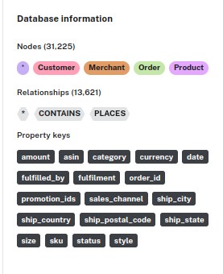

> ## creating product entity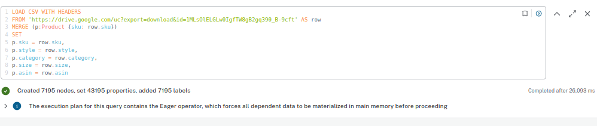
> ## creating merchant entity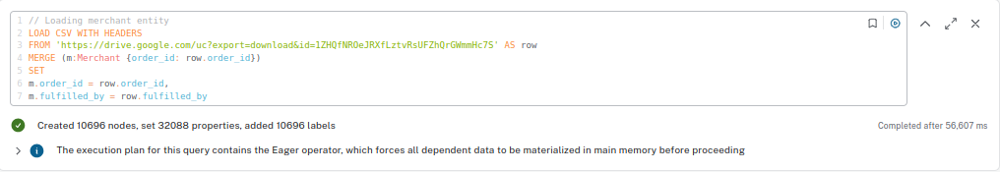
> ## creating order entity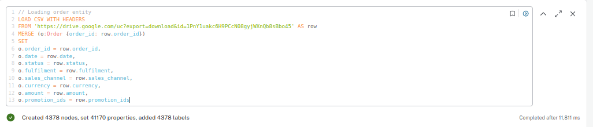
> ## creating customer entity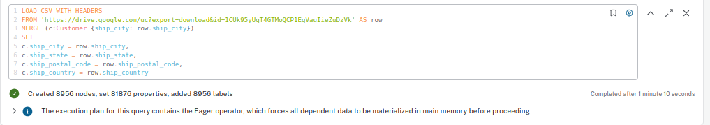

> ## Creating Customer Places order relationship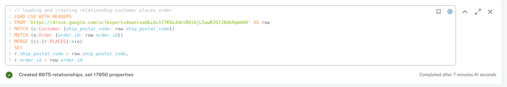
> ## creating order contains product relationship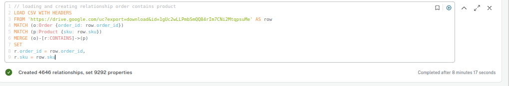
> ## I couldn't add the fulfills relationship because of memory shortage on the neo4j server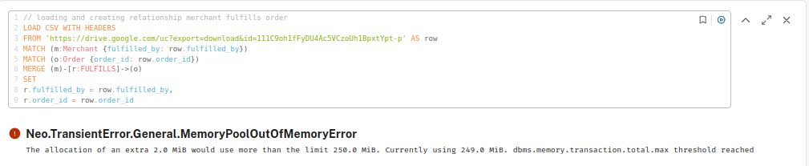

>  ## making product sku unique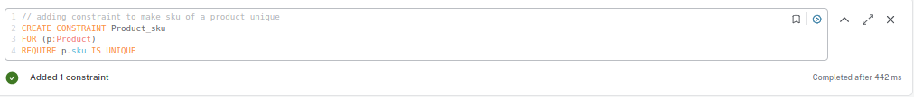

> ## Querying products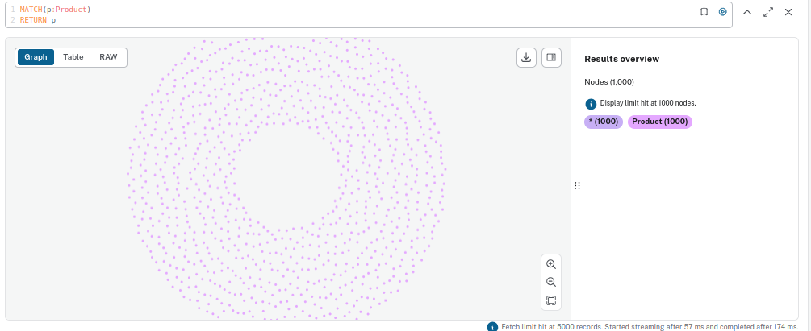
> ## Querying Customers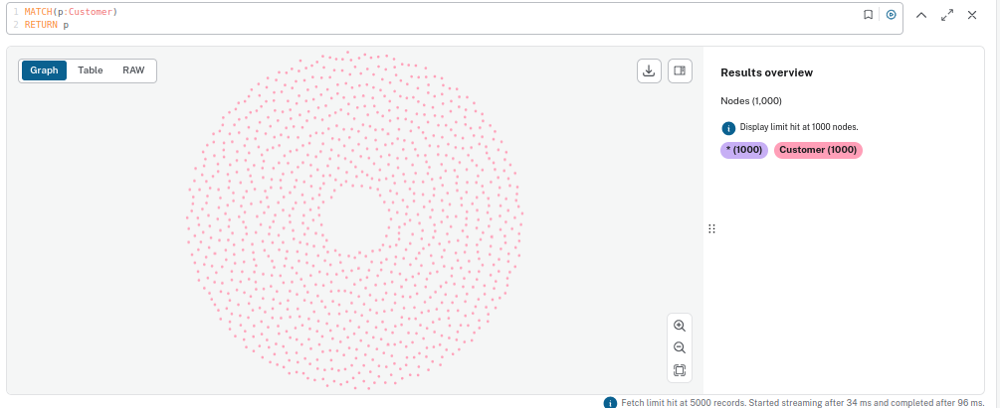

> ## Querying order contains product relationship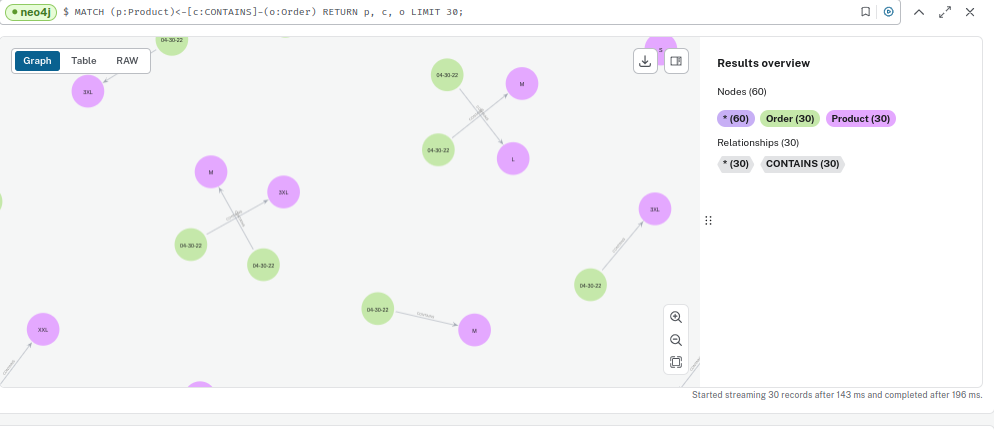
> ## Querying Customer Places order relationship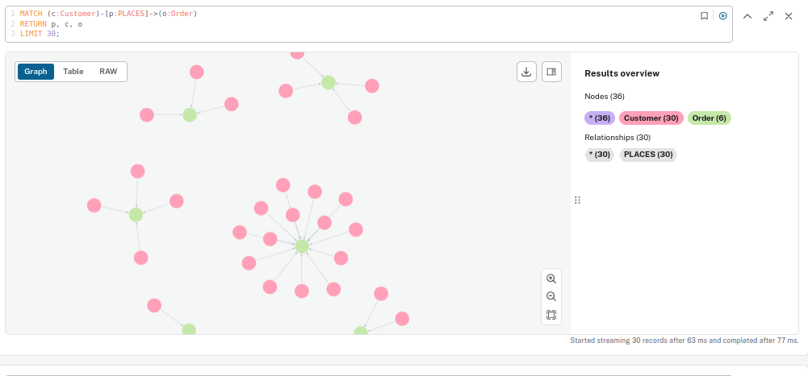